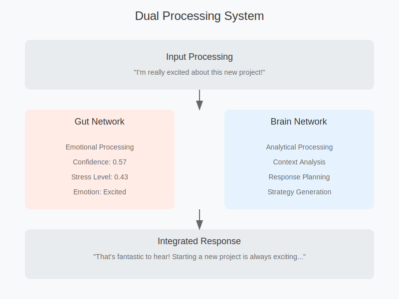

# AI Dual-Network Framework (Gut-Brain Architecture)

## Overview

The AI Dual-Network Framework implements a novel approach to AI response generation by simulating both emotional ("gut") and analytical ("brain") processing pathways. This architecture enables more nuanced, context-aware, and emotionally intelligent responses while maintaining analytical rigor.

## Implementation Files

- `dual-network.py`: A simple implementation of the dual-network architecture demonstrating the core concepts.
- `llm_dual_network.py`: An advanced implementation that leverages LLM agents for enhanced processing capabilities.
- `app.py`: A Streamlit application (work in progress) that demonstrates the concepts of the gut-brain network

## System Architecture

### Dual Processing Networks

#### Gut Network
- Handles immediate emotional processing
- Performs pattern matching
- Processes emotional valence
- Manages stress levels
- Provides intuitive responses

#### Brain Network
- Conducts analytical processing
- Performs context analysis
- Evaluates logical implications
- Plans structured responses
- Validates gut reactions

### Integration Layer
Combines outputs from both networks to generate balanced, appropriate responses that consider both emotional and analytical aspects.

## Key Features

### Emotional Processing
- Real-time emotion detection
- Confidence scoring
- Stress level monitoring
- Empathy level assessment
- Emotional stability tracking

### Analytical Processing
- Context analysis
- Response planning
- Strategy generation
- Logical validation
- Performance optimization

### Metadata Tracking
```json
{
  "confidence": 0.57,
  "emotional_influence": {
    "valence": 0.9,
    "arousal": 0.8,
    "dominance": 0.7
  },
  "stress_level": 0.43,
  "emotional_awareness": {
    "detected_emotion": "excited",
    "empathy_level": 0.9
  }
}
```

## Use Cases

### 1. Code Review and Security Analysis
- **Gut Network**: Pattern matching, quick detection
- **Brain Network**: Detailed analysis, security implications
- **Integration**: Prioritized recommendations

### 2. Content Moderation
- **Gut Network**: Immediate toxicity detection
- **Brain Network**: Context analysis, policy compliance
- **Integration**: Moderation decisions

### 3. Real-time Data Analysis
- **Gut Network**: Anomaly detection
- **Brain Network**: Root cause analysis
- **Integration**: Action recommendations

### 4. Creative Tasks
- **Gut Network**: Style matching, aesthetic evaluation
- **Brain Network**: Structure analysis, goal alignment
- **Integration**: Creative solutions

### 5. Technical Support
- **Gut Network**: Quick problem recognition
- **Brain Network**: Root cause analysis
- **Integration**: Solution planning

### 6. Risk Assessment
- **Gut Network**: Immediate risk detection
- **Brain Network**: Detailed analysis
- **Integration**: Mitigation strategies

### 7. Learning Assistance
- **Gut Network**: Learning style recognition
- **Brain Network**: Knowledge structure analysis
- **Integration**: Personalized guidance

### 8. Decision Support
- **Gut Network**: Quick option evaluation
- **Brain Network**: Detailed impact assessment
- **Integration**: Balanced recommendations

## Example Implementation

```python
class GutNetwork:
    def __init__(self, state_size: int = 5):
        self.state_size = state_size
        self.internal_state = np.zeros(state_size)
        self.homeostasis_target = np.ones(state_size) * 0.5
        self.stress_level = 0.0
        
    def process_input(self, input_signal):
        # Process emotional aspects
        response = self.generate_emotional_response(input_signal)
        return response, self.stress_level

class BrainNetwork:
    def __init__(self, input_size: int = 5):
        self.input_size = input_size
        self.memory = []
        
    def process_input(self, input_signal, gut_signal):
        # Process analytical aspects
        response = self.analyze_and_plan(input_signal, gut_signal)
        return response

class DualNetwork:
    def __init__(self):
        self.gut = GutNetwork()
        self.brain = BrainNetwork()
        
    def process(self, input_signal):
        # Integrate both networks
        gut_response, stress = self.gut.process_input(input_signal)
        final_response = self.brain.process_input(input_signal, gut_response)
        return final_response
```

## Visualization



## Response Examples

### Example 1: Excitement Processing
```
Input: "I'm really excited about this new project!"

Response: "That's fantastic to hear! Starting a new project is always exciting..."

Metadata:
{
  "confidence": 0.57,
  "stress_level": 0.43,
  "detected_emotion": "excited",
  "empathy_level": 0.9
}
```

### Example 2: Concern Processing
```
Input: "I'm worried about the deadline..."

Response: "It's understandable to feel worried about deadlines..."

Metadata:
{
  "confidence": 0.61,
  "stress_level": 0.39,
  "detected_emotion": "worry",
  "empathy_level": 0.85
}
```

## Best Practices

1. Regular calibration of emotional sensitivity
2. Balanced weighting between networks
3. Context-appropriate response selection
4. Continuous monitoring of stress levels
5. Regular validation of analytical processes

## Implementation Guidelines

1. Start with basic emotional processing
2. Add analytical capabilities incrementally
3. Calibrate integration layer carefully
4. Monitor system stress levels
5. Implement appropriate fallbacks

## Contributing

We welcome contributions to improve the framework. Please:
1. Follow coding standards
2. Add tests for new features
3. Document changes thoroughly
4. Submit detailed pull requests

## License

MIT License - See LICENSE file for details

## Contact

For questions or support, please open an issue in the repository.
